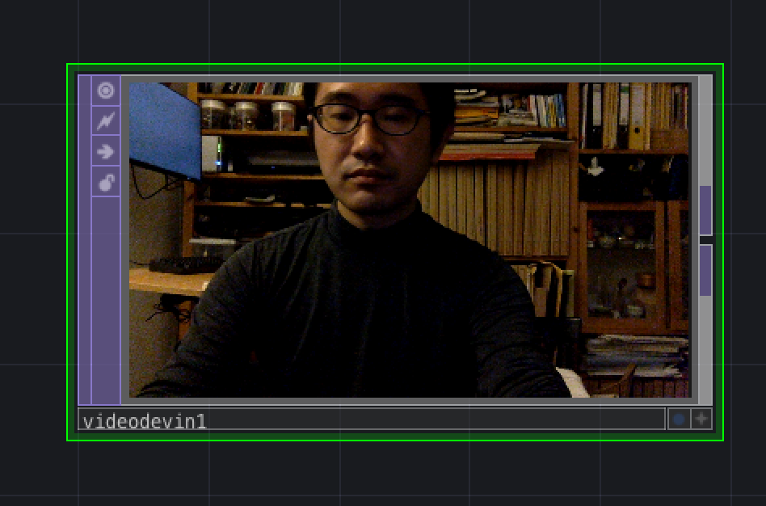
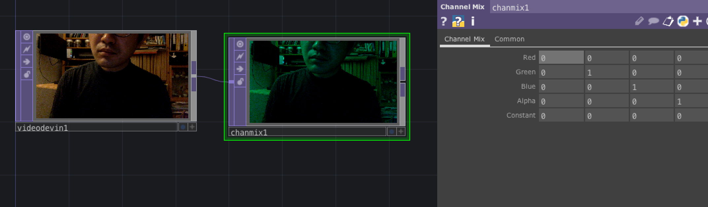
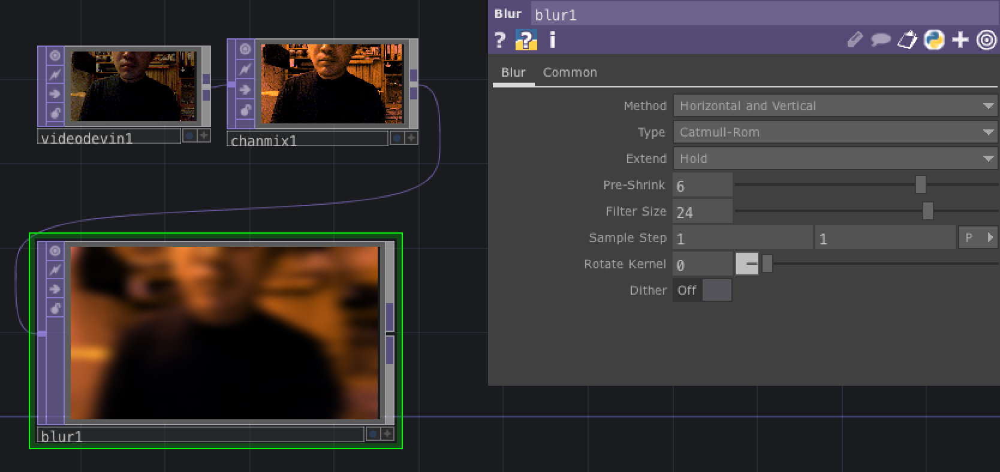
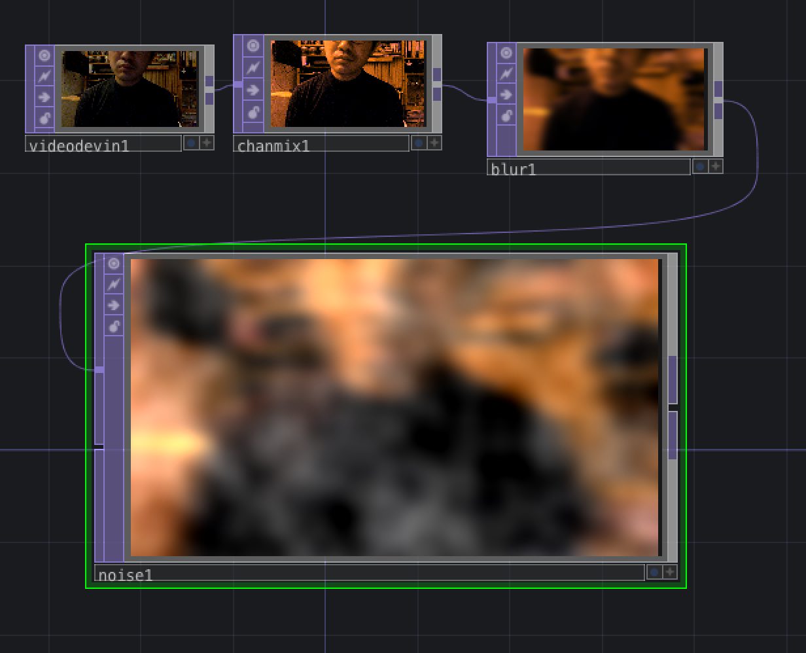

# Klasse 1

Jitter vs Touch Designer (1 - Live Video)

## Touch Designer

tab - OP Create Dialog öffnen

6 Kategorien

- COMP ... Component Operator (3D Modell)
- TOP ... Texture Operator (2D)
- CHOP ... Channel Operator (wie Max)
- SOP ... Surface OPerator (Oberfläche von 3D Modell bearbeiten)
- MAT ... Material Operator (Farbe von 3D Modell)
- DAT ... Data Operator (Data)

### 1. Video In

**TOP/Video Device In operator**

### 2. Farbe bearbeiten

**TOP/Channel Mix operator**

### 3. Blur Effect

**TOP/Blur operator**

#### 4. Noise Effect

**TOP/Noise operator**

#### 5. Clop Effect

**TOP/

### 4. Aufnahme

### 5. Affine Transformation

### 6. 3D Texture 

### 7. Parameter Steuerung

### 8. 

### 9. Max + Touch Designer (OSC)

### 10. Full Screen

