# Klasse 1

## Allgemeine Probleme von Visualisierung

- Super Aufwendig für Computer 
- Apple Computer Inc. und OpenGL
- 2D und 3D
- Sample Rate vs FPS
- Synchronisierung


### Wie aufwendig?

#### Video

	- 1920 x 1080 (HD) =  2073600 Pixels
	- 30 FPS (Frame Per Seconds) -> x 30
	- RGB (Red, Green, Blue) -> 3 x 8 = 24 bits
	= 1492992000 bits / s

#### Audio
	- 44110 SR
	- 16 bit 
	- Stereo -> x2
	= 1411200 bits / s
	
1492992000 / 1411200 = 1058

### CPU ist nicht genug

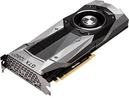

Grafikkarte (GTX 1080 Ti)

- CPU hat wenige (z.B. Core i7 / 4-6) aber schnellere Kerne
- GPU hat viele (z.B. GTX 1080 Ti / 2560) aber langsammere Kerne

Man muss gut GPU verwenden, um Bilder schneller zu rendern.

### Touch Designer vs Jitter


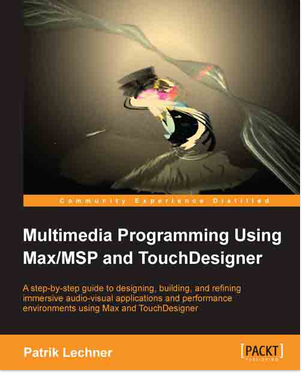

Multimedia Programming using Max/MSP and Touchdesigner
von Patrik Lechner

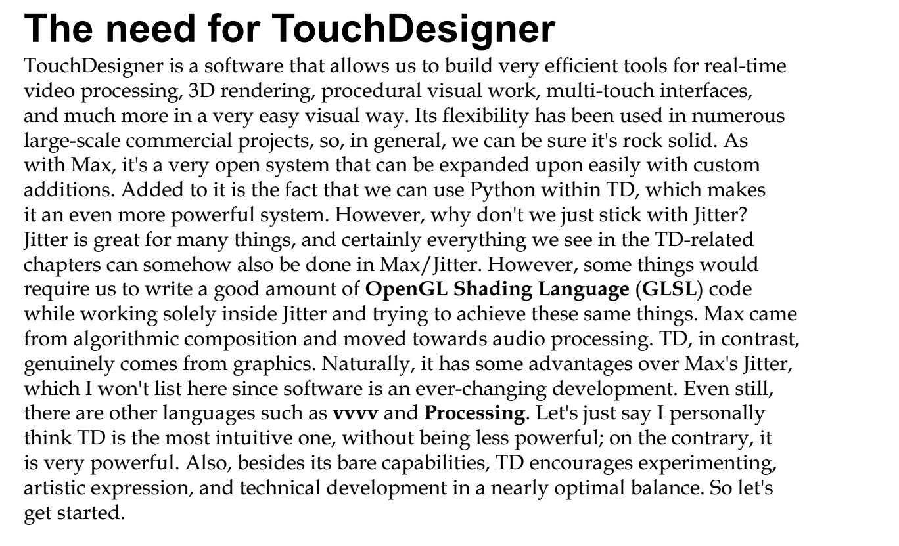

- GLSL (Computersprache fürs Programm, das auf einer Videokarte läuft)
	- Jitter ... man muss selbst GLSL schreiben, um Videokarte effizient zu benutzen
	- Touch Designer ... man kann mit GUI intuitiv GLSL verwenden.

- Python ... eine Programmiersprache


## Touch Designer

tab - OP Create Dialog öffnen

6 Kategorien

- COMP ... Component Operator (3D Modell)
- TOP ... Texture Operator (2D)
- CHOP ... Channel Operator (wie Max)
- SOP ... Surface OPerator (Oberfläche von 3D Modell bearbeiten)
- MAT ... Material Operator (Farbe von 3D Modell)
- DAT ... Data Operator (Data)

### 1. Video In

**TOP/Video Device In operator**


### 2. Farbe bearbeiten

**TOP/Channel Mix operator**


```
Hinweis
Taste 'd'  ... Display mode
```

### 3. Blur Effect

**TOP/Blur operator**


```
Hinweis
Taste 'p'  ... Parameter toggle
```

#### 4. Noise Effect

**TOP/Noise operator**


### 5. Affine Transformation

**TOP/Transform operator**
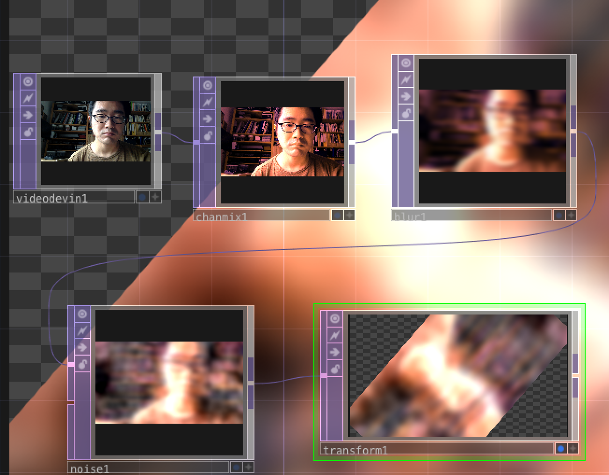


### 6. Parameter Steuerung 

#### absTime.frame

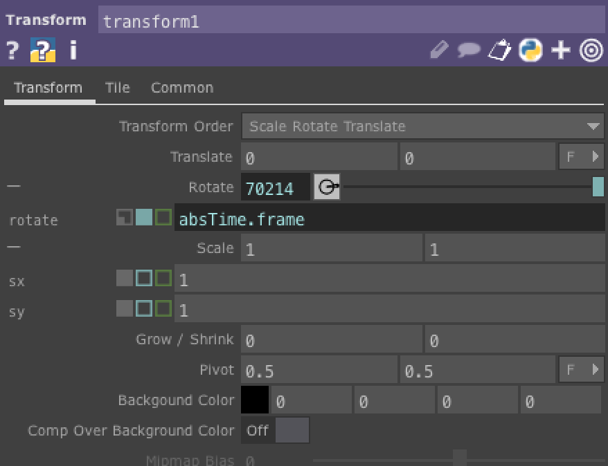

#### mit CHOP

**CHOP/LFO**
funktioniert wie cycle~ saw~ rect~ etc.

**CHOP/Trail**
funktioniert wie scope~ in Max

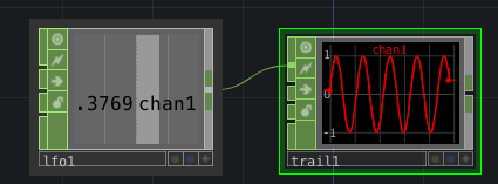

### 7. Exporting Parameter

Verknopfung zwischen CHOP und Parameter

- "+" Knopf von CHOP drücken
- von CHOP auf Parameter D&D machen
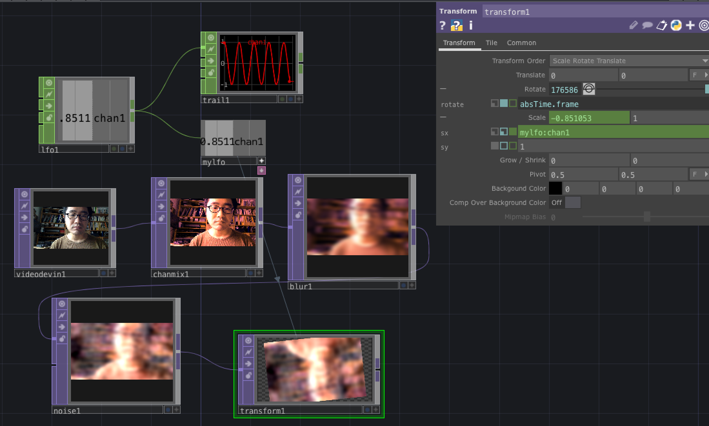

### 8. Lautstärke

**CHOP/AudioDevice**
Audio Eingänge ... wie adc~

**CHOP/Analyze**
analyziert verschiedene Aspekte des eingegebenen Signals

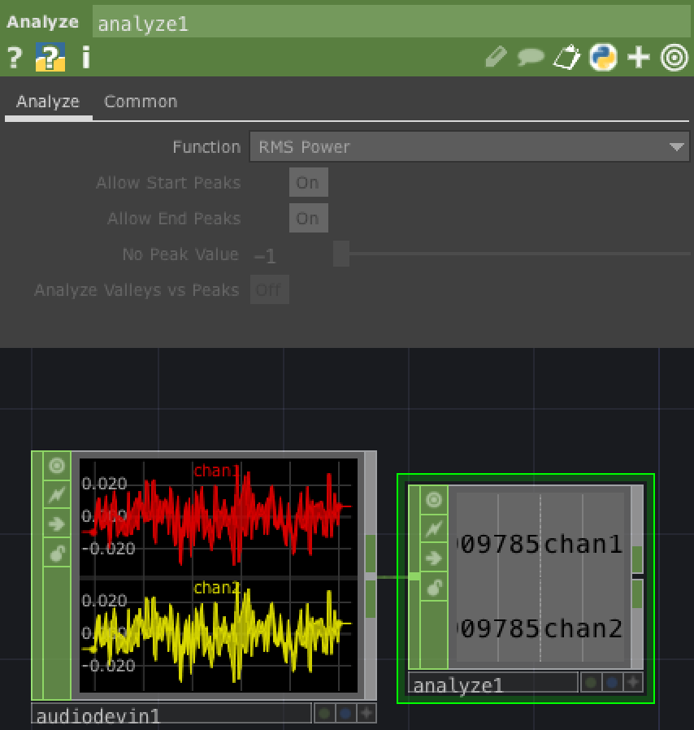

### 9. Performance mode

**TOP/out**
erstellt einen "outlet".
Mit [F1] kann man FullScreen Modus (Performance Mode) starten.

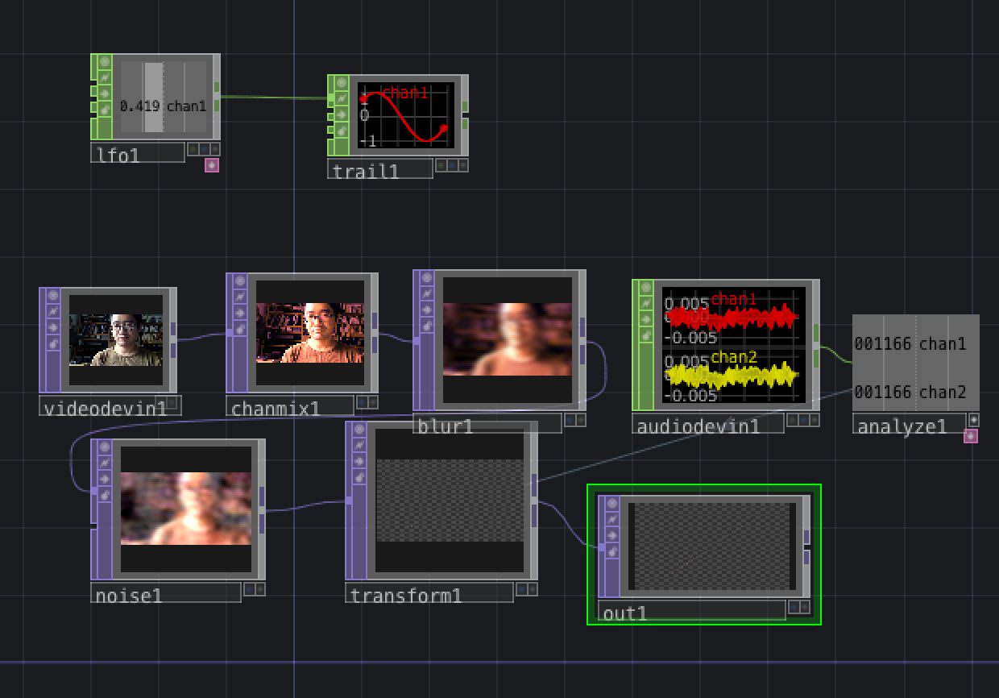

### 10. Foto


**TOP/cache**

- Active: off

funktioniert wie snapshot~ Objekt

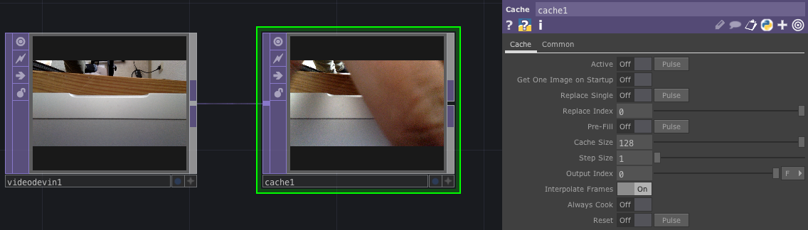

### 11. Delay

**TOP/cache**

- output index: -5

funktioniert wie delay~ Objekt


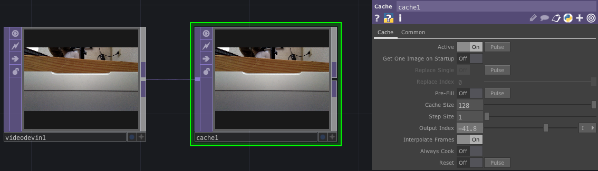


### 12. Video Scratching
**TOP/cacheselect**

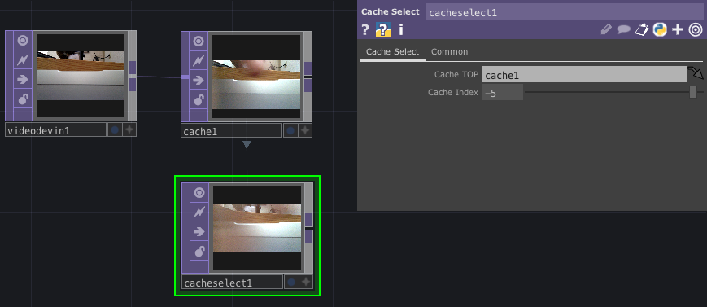

### 13. Doppelgänger

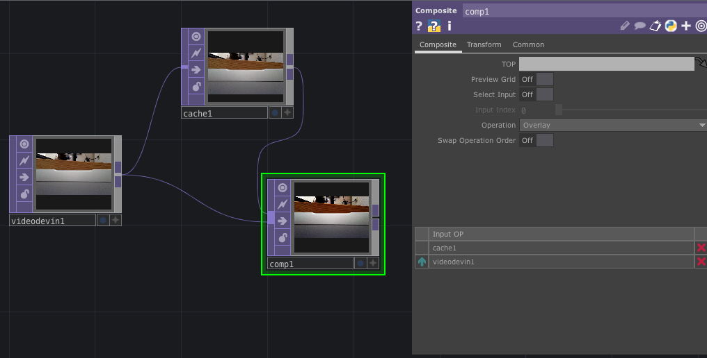


### HA.

Programmieren Sie ein TD-Netzwerk, das einen originellen 2D Video-Effekt verwirklicht.
