# Klasse 2

## Jitter

### 1. Video In

- qmetro
- jit.qt.grab
- jit.pwindow

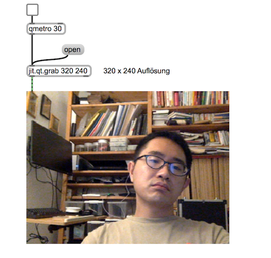

### 2. Farbe bearbeiten

- jit.unpack (RGB auseinandernehmen)

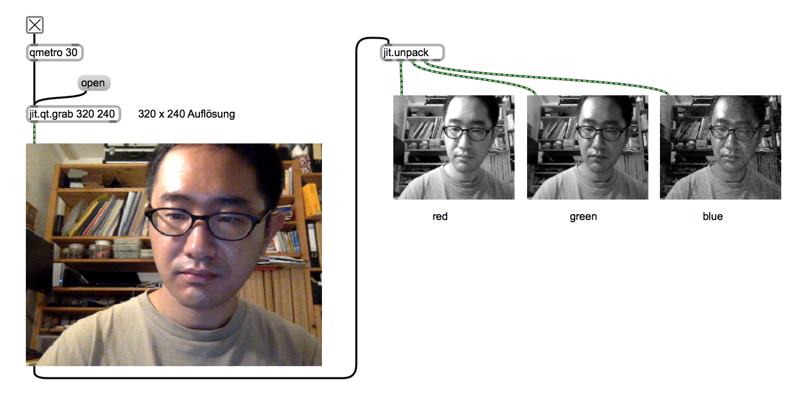

- jit.pack (RGB wiederherstellen)

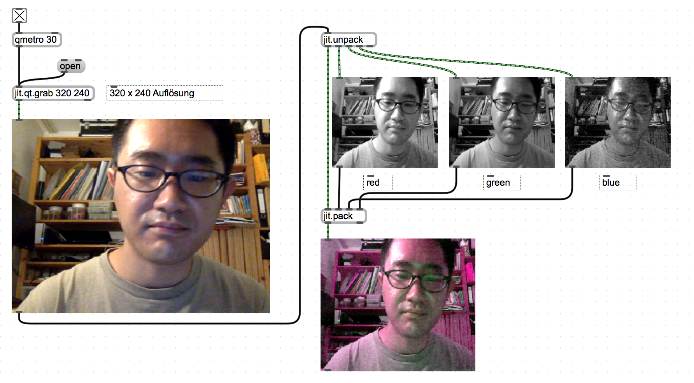

- jit.* (Multiplikation)
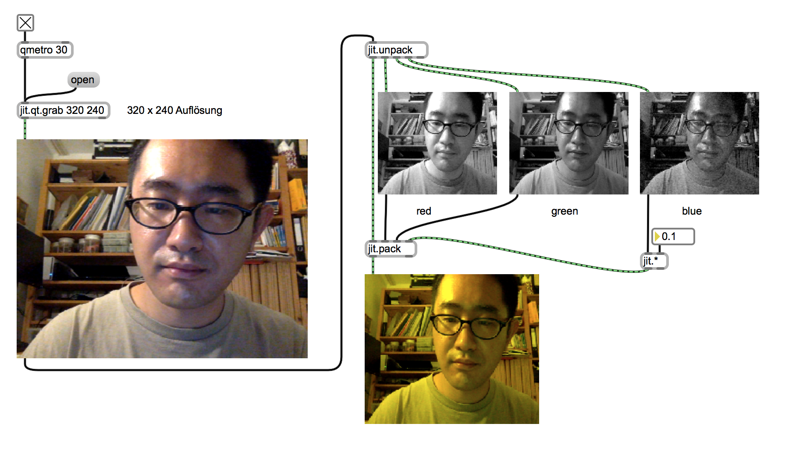

- Was TOP/channel mix operator in TD macht
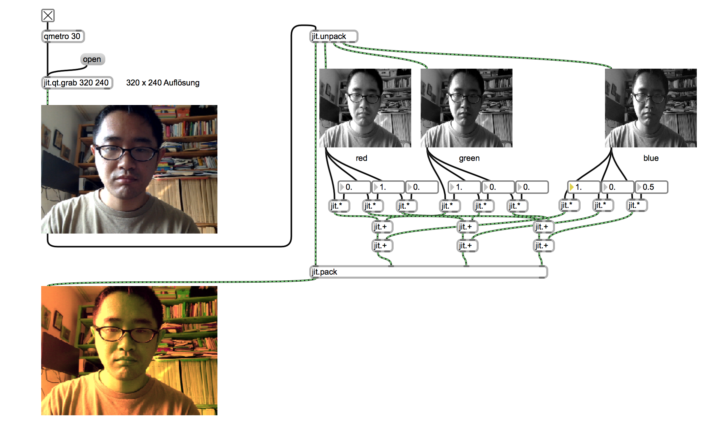

#### 3. Blur Effect

- jit.qt.effect (QuickTime Effect)

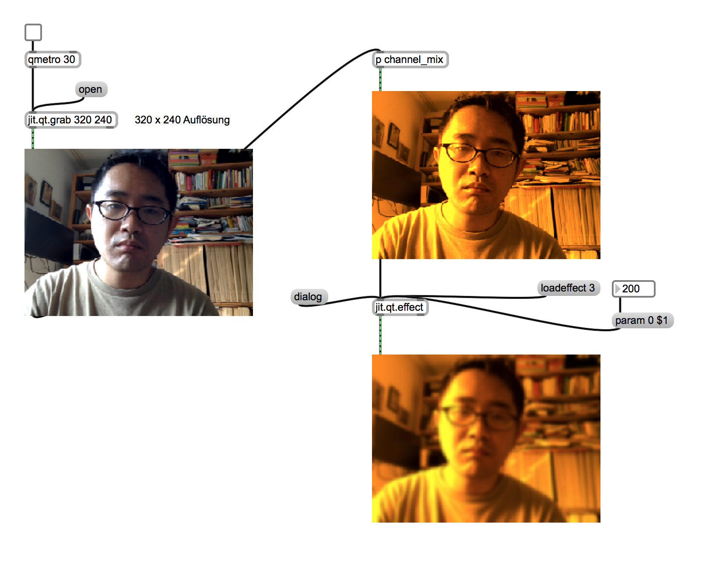

### 4. Affine Transformation

- jit.rota (Affine Transformation Objekt)

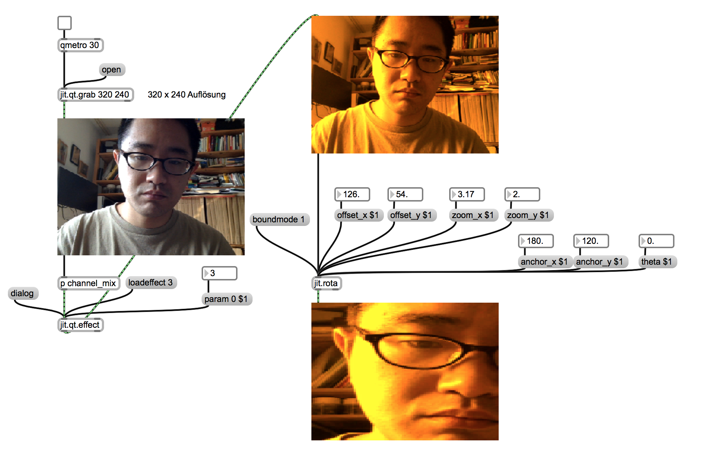

### 5. Parameter Steuerung 

#### counter

- counter
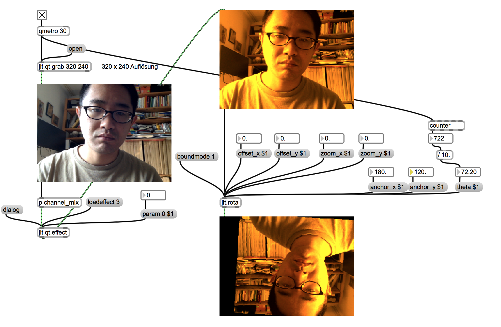

#### mit LFO

- sin
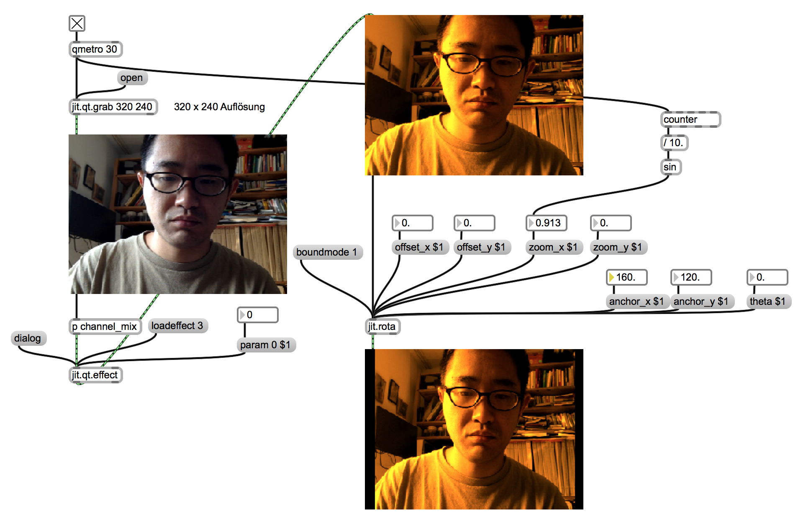

### 6. Lautstärke

- ezadc~
- average~
- snapshot~

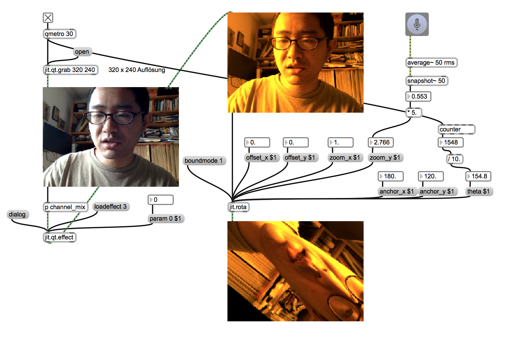

### 7. Performance mode

- jit.window (pwindow auf einem anderen Fenster)

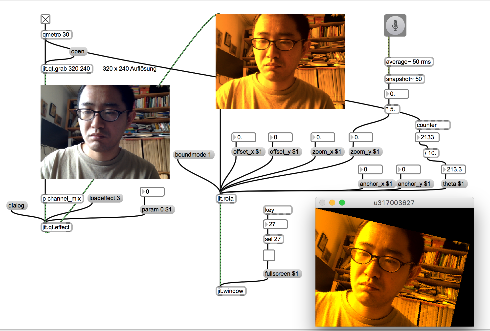

### 8. Delay

- jit.matrixset (Buffer für Video)

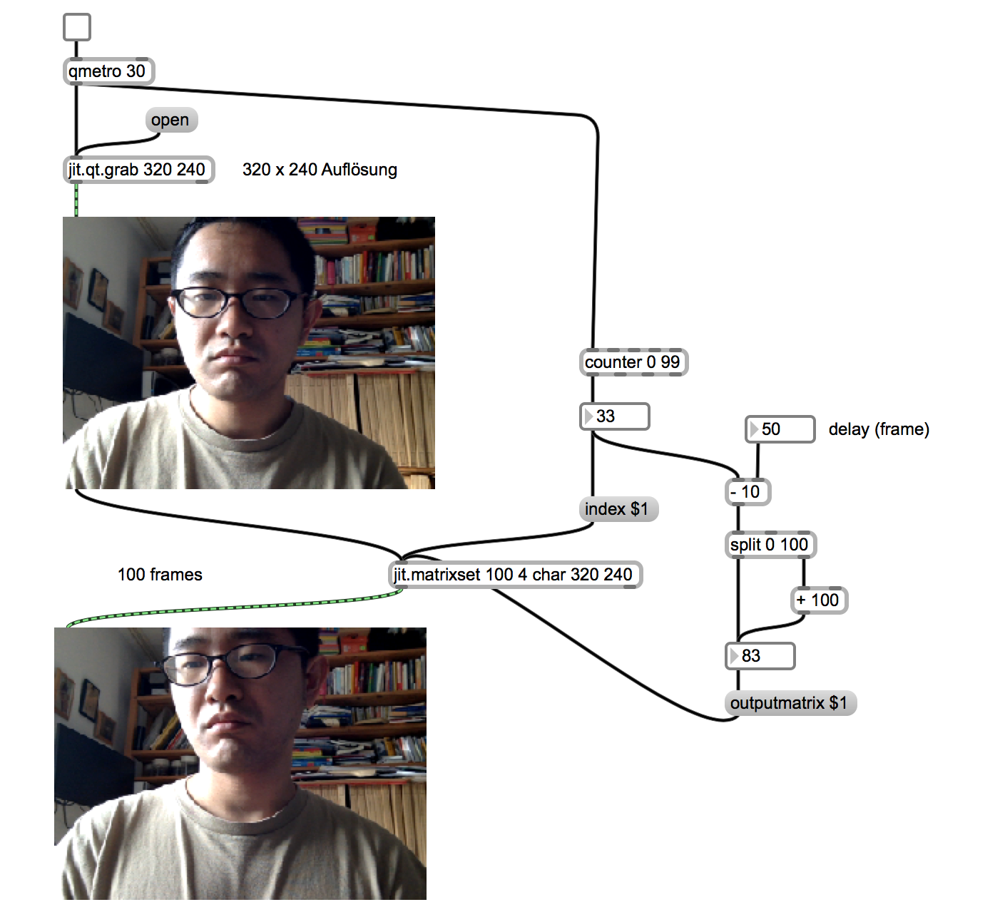

### 9. Doppelgänger

- jit.op (verschiedene mathematische Funktionen)

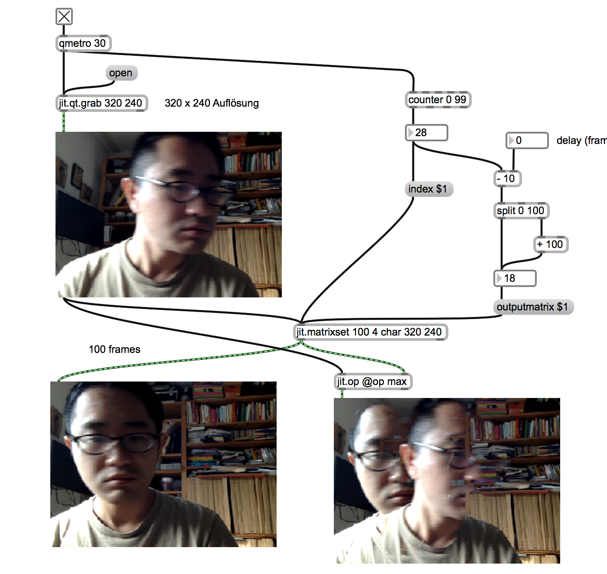

### HA.

Programmieren Sie ein Jitter Patch, das einen originellen 2D Video-Effekt verwirklicht.
