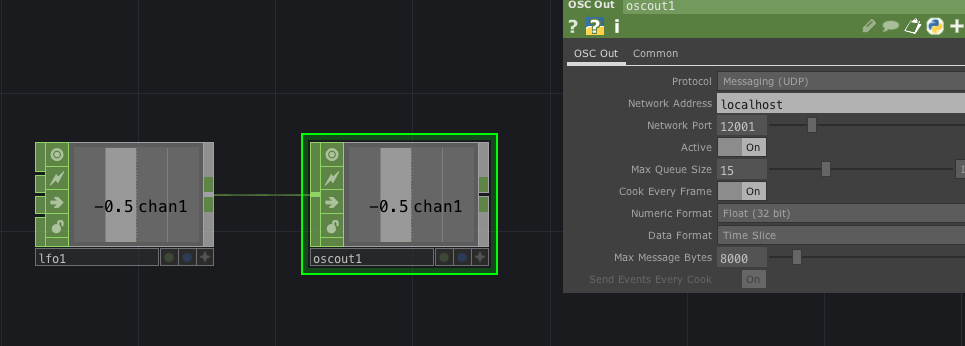
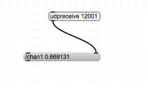
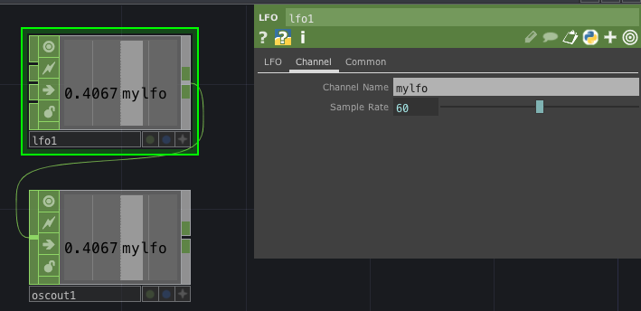
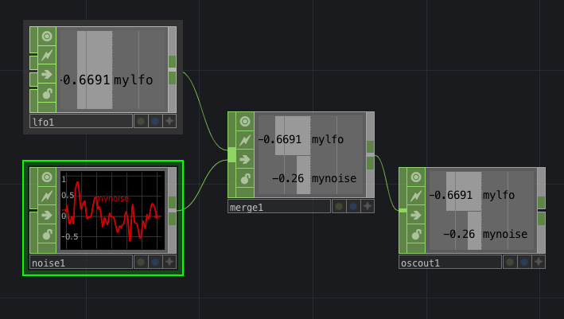
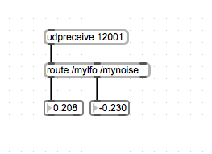
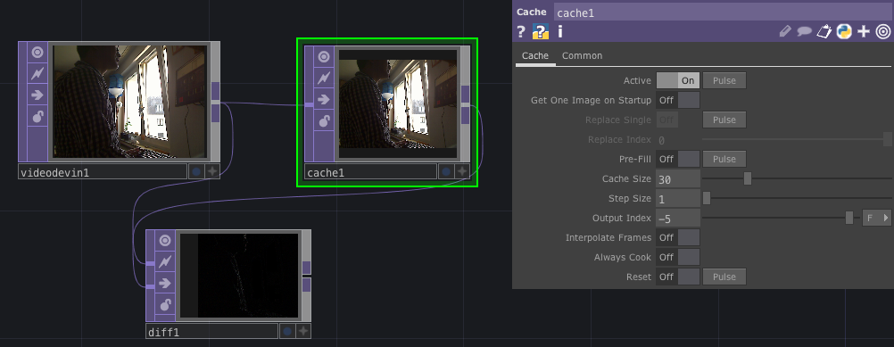
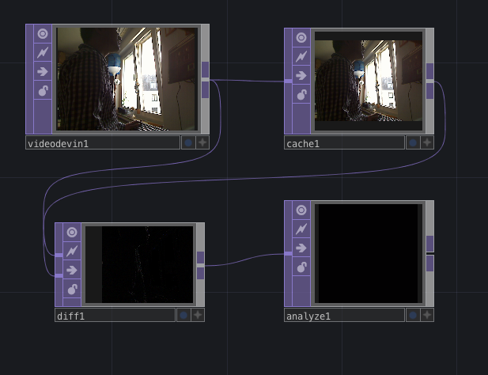
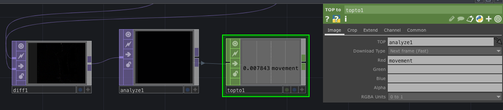
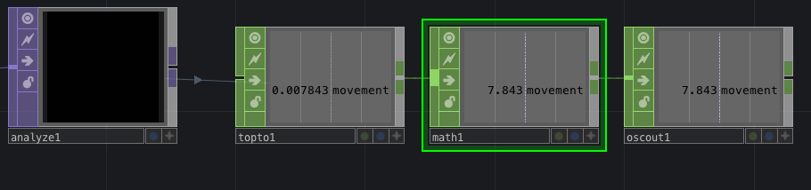
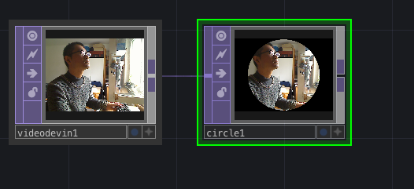

# Klasse 3


## Datenübertragung mit OSC 

OSC ... Open Sound Control

[http://opensoundcontrol.org](http://opensoundcontrol.org)

OSC-Beispiele

```
/scale 30 42 1
/osc1/freq 880
/stop 
```

Eine OSC message besteht aus eine **OSC Adresse** und **OSC Argumente**.
Die Anzahl der Argumente ist 0 bis N. 

- OSC Adresse ...   beschreibt die Bedeutung der Argumente
- OSC Arguments ... Werte

### von Max an TD 

#### Max als Absender


- -9.1 ... OSC Argument
- /scale ... OSC Address
- localhost ... der Absender schickt Nachricht an den gleichen Rechner
- 12000 ... Port Nummer (muss über 10000)


#### TD als Empfänger


#### Anwendung 


#### Mehrkanal


#### Null Operator

It is good practice to always export channels from a Null CHOP appended to the end of your network. The reason for this is simple. If you export from the last node in your network, but decide later that you need to filter the data further, you would have to append the new filter CHOP and then redo all your export connections form this new node. Using a Null CHOP at the end of your network as an exporting place holder, you can always insert another node into the network directly before the Null. This will keep all your export connections intact.

### von TD an Max

- LFO an Max schicken



- Empfängfer in Max




#### Änderung der OSC-Address





#### Mehrere Quellen




- **CHOP merge** bündelt mehrere Quellen.




#### Sonifikation

##### Differenz = Bewegung


##### Durchschnitt der ganzen Pixel


##### TOP auf CHOP
- **CHOP topto** umwandelt TOP in CHOP



##### Skalierung und OSCout




### Andere TOP Operators

### Effekte
#### Flip: Spiegel

- Flip 
	- Flip X : on
- Composite
	- Mode : Overlay 


#### Edge: Konturerkennung

- Edge
- Emboss


#### Noise

- Noise


#### Circle

- Circle
	- Fill Alpha: 0
	- Background Alpha: 1


#### Crop : Zuschneiden

- Crop
	- Crop Left: 0.25
	- Crop Right: 0.25 	


#### Fit : Einstellung der Auflösung

- Fit
	- Resolution: 800 600


#### Over : Überlargern

- Over


#### Beil?

