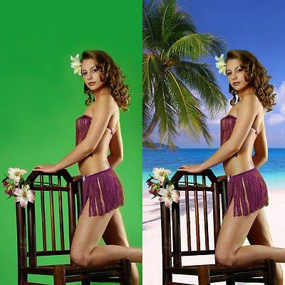
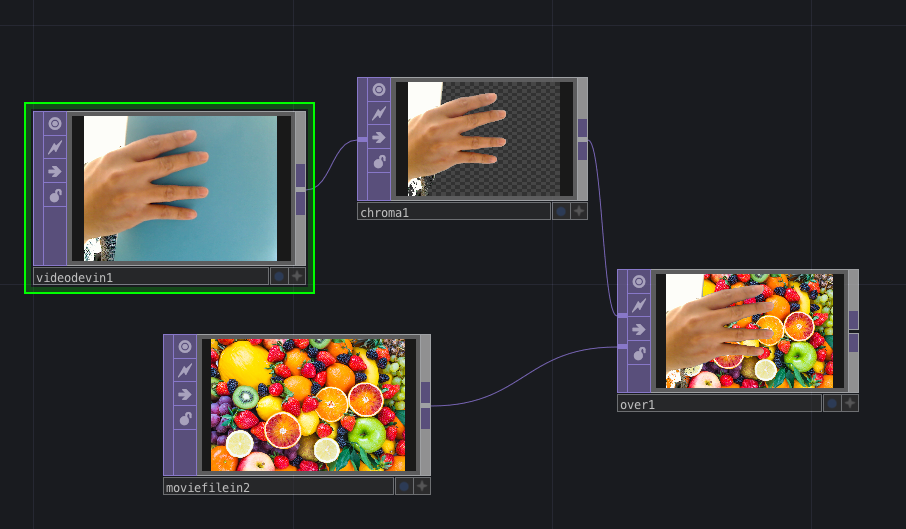

# Klasse 4

### RGB und HSV

#### RGB
R ... Rot
G ... Grün
B ... Blau

#### HSV Farbraum
H ... Hue
S ... Saturation
V ... Value

- Hue = Farbwert : Farbwinkel auf dem Farbkreis (0° für Rot, 120° für Grün, 240° für Blau)
- Saturation = Farbsättigung: (0% = Neutralgrau, 50% = wenig gesättigte Farbe, 100% = gesättigte, reine Farbe), entspricht einem Intervall von Null bis Eins
- Value = Hellwert : (0% = keine Helligkeit, 100% = volle Helligkeit), entspricht einem Intervall von Null bis Eins.

### Chroma key

Grüne Pixel -> Druchsichtig -> Ein anderes Bild hinter dem Objekt

- Chroma Key
	- Min Hue / Max Hue ... Man muss vorsichtig einstellen
- Over
	- überlagern 	

