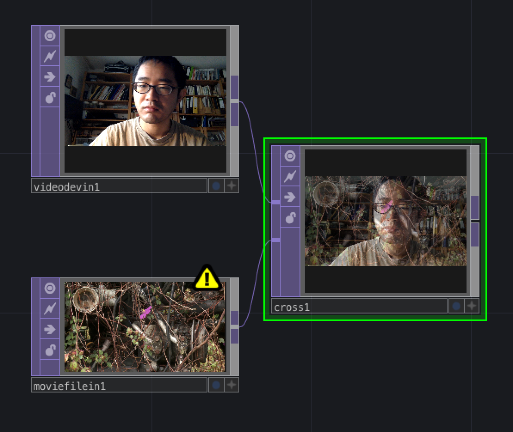

# Klasse 4

## Oft gestellte Frage / Jitter vs TD

F: 
ist Jitter langasamer als TD?

A:
Jein. Das ist abhägig von Jitter-Programm

---
F:
Warum ist TD oft schneller als Jitter

A:
Weil TD hauptsächlich die Grafikkarte für die Verarbeitung benutzt.

---
F:
Kann man die Grafikkarte auch mit Jitter benutzen?

A:
Ja. Man kann benutzen, aber man muss .jxs Datei schreiben.
.jxs ist fast C. Das ist nicht intuitiv im Vergliech zu TD.

---
F:
Was sind die Beschränkungen der TD-Non-Commercial-Lizenz

A:
[https://www.derivative.ca/wiki088/index.php?title=Licensing](https://www.derivative.ca/wiki088/index.php?title=Licensing)

- Auflösung: 1280 x 1280

### Thresh

**TOP/thresh**
- prüft die Helligkeit(Luminance) jedes Pixels und wandelt das Pixel.

### RGB Key

**TOP/rgbkey**
- wenn die Farbe eines Pixels zwischen Min und Max Wert, wird das Pixel nicht geändert. Wenn nicht, wird das Pixel durchsichtig.

### RGB und HSV

#### RGB
- R ... Rot
- G ... Grün
- B ... Blau

#### HSV Farbraum

- H ... Hue
- S ... Saturation
- V ... Value

- Hue = Farbwert : Farbwinkel auf dem Farbkreis (0° für Rot, 120° für Grün, 240° für Blau)
- Saturation = Farbsättigung: (0% = Neutralgrau, 50% = wenig gesättigte Farbe, 100% = gesättigte, reine Farbe), entspricht einem Intervall von Null bis Eins
- Value = Hellwert : (0% = keine Helligkeit, 100% = volle Helligkeit), entspricht einem Intervall von Null bis Eins.

[http://colorizer.org](http://colorizer.org)

### Umwandeler

**TOP/rgbhsv**

**TOP/hsvrgb**

### Farbeinstellung mit HSV

**TOP/hsvadjust**
- Farbeinstellung im HSV-Farbraum

[parameters](http://www.derivative.ca/wiki099/index.php?title=HSV_Adjust_TOP)

### Verknöpfung mit der Lautstärke 

### Chroma key

Grüne Pixel -> Druchsichtig -> Ein anderes Bild hinter dem Objekt

- Chroma Key
	- Min Hue / Max Hue ... Man muss vorsichtig einstellen
- Over
	- überlagern 	

### Distortion

**TOP/corner pin**

### Matte

**TOP/matte**

### Reorder

**TOP/reorder**

### Movie Out

**TOP/movie out**

### Cross
**TOP/cross**

### Switching

**TOP/switch**

### Text

**TOP/text**
- erstellt 2D Text 

**DAT/table**
- bearbeitet tablalischen Text

#### Text Editor

							

#### Lauftext

- text1/ Wordwrap: on

### Feedback

- videodevicein -> feedback -> composite 

- videodevice -> composite (Modus: Over)

- comp1 als Target Top von Feedback1
					

- Level Top zwischen Feedback und Composite hinzufügen
- Post/Opacity von LevelTop = 0.9
	

