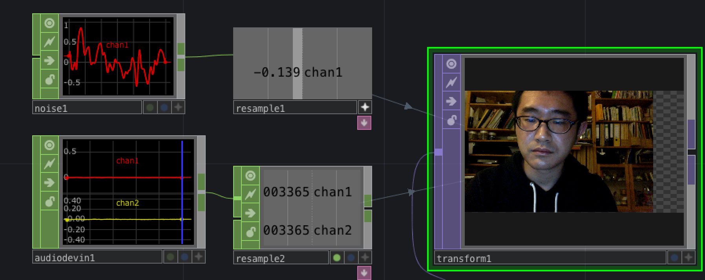

# Klasse 5

### CHOP und Resampling

CHOP Export von Audio Device In und Noise ist unmöglich

- Audio Device In : 44100 

### CHOP Export 

### CHOP Reference 

### Vorteil und Nachteil

- Export
	- Absender hat eine Liste der Empfänger (DAT)
	- Umbenennung des Absenders verursacht keinen Fehler
	- Man kann nicht beim Empfänger Werte schnell "kochen"
	- der Absender und der Empfänger müssen im gleichen Container sein
	
- Reference
	- Absender hat keine Liste der Empfänger
	- Umbenennung des Absenders verursacht einen Fehler
	- Man kann beim Empfänger Werte schnell "kochen" aber das ist nicht sichtbar, wenn das Parameter Panel zu ist
	- der Empfänger kann die Werte von allen CHOP Operators im Netzwerk benuzen

- Tipp: Export ist normalerweise Besser für Debugging

## drei Beispile der Bildverarbeitungen mit Klang

### 1. Wave Distortion

**TOP/displace**

Die Frabe der Pixels im zweiten Bild wird benutzt als koordinate von Pixel (x,y) des ersten Bild.

**CHOP/select**

selektiret Channel.
In diesem Beispiel chan2 ist unnögig.

**TOP/chop to**

Umwandler: Chop(Signal)->Top(Pixel)

#### Network

- parameter von displace
- 

#### Weiterentwicklung

- Samplerate Änderung
- mit Audio Filter
- Gate oder Compressor

### 2. Wave Masking

#### Network

**CHOP/audiofilter**

Audio Filter LPF / HPF.
Filter CHOP ist nicht passend für Audio.

**TOP/multiply**

- Parameter

- Fixed Layer : Die Auflösung des ausgewählten Eingang wird verwedent

#### Weiterentwicklung
- 2D Wave masking mit delay

### 3. Sonogramm

#### Network

**TOP/audiospectrum**
führt FFT aus.

- Output Length : Set Length Manually
- Set Output Length: 1024

**CHOP/timeline**

gibt Werte von "timeline" aus.

- Feedback Reset Parameter mit CHOP reference
löscht das Bild, wenn "On" ist.

