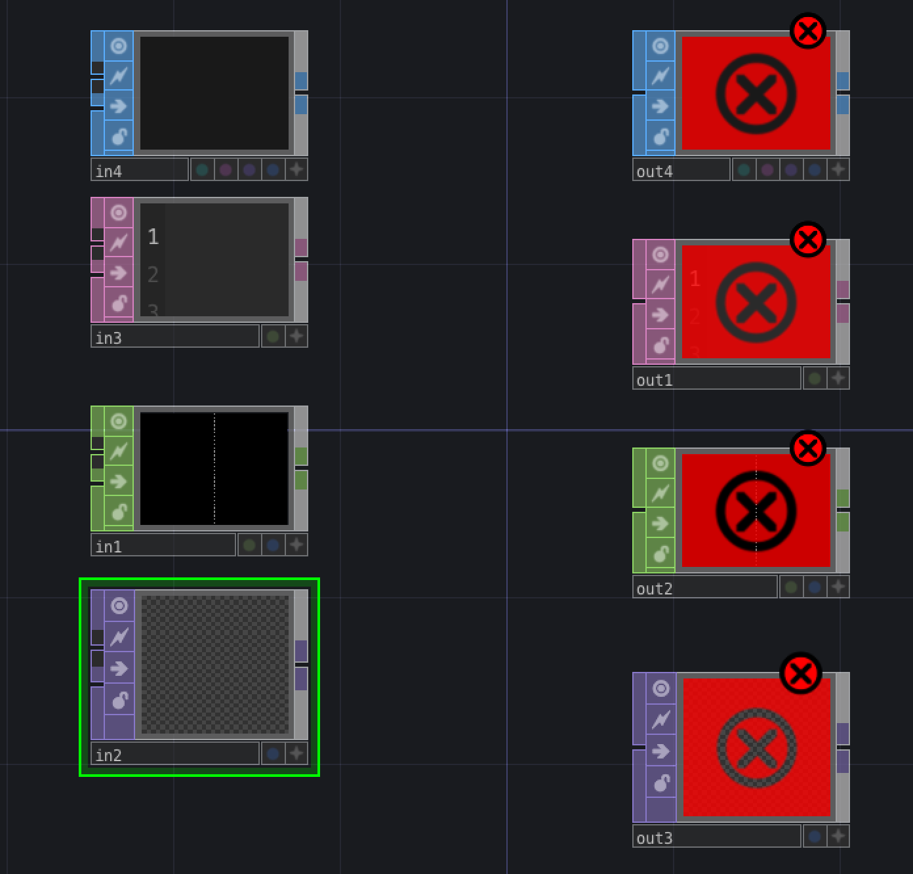

# Klasse 6

### die Würzel

- perform : COMP/Window
- Project1 : Container
- local : Container

**COMP/Window**
- Einstellung eines Fensters

**COMP/Container**
- Behälter eines Netzwerks

**SOP/in DAT/in CHOP/in TOP/in**

**SOP/out DAT/out CHOP/out TOP/out**

### 3D in Touch Designer

**3D Setup**

**COMP/camera**
- steuert die Position und die Eigenschaft eines Kameras

**COMP/light**
- steuert die Helligkeit und Farbe eines Lichtes

**COMP/geom**
- steuert die Position und die Eigenschaft eines 3D-Modells

**TOP/render**
- rasterisiert eine 3D-Szene

### Animation mit CHOP

- COMP operator akzeptiert auch CHOP export

### 3D Modelle

**SOP/Sphere**
**SOP/Cube**
**SOP/Torus**
**SOP/Tube**

in COMP/geom

### 3D Text

**SOP/text**

### Model Import

**SOP/filein**
- obj Datein 

### Farbe eines 3D-Modells

**MAT/phong**

- Phong: Phong Reflection Model

### Texture Mapping

- phong1/Colormap: moviefilein1

### Video als Texture

### Vertex-Verarbeitung

#### Affine-Transformation

**SOP/transform**

**SOP/noise**

### Wellenform als SOP

