# Klasse 7

### COMP/Animation und Animation Editor

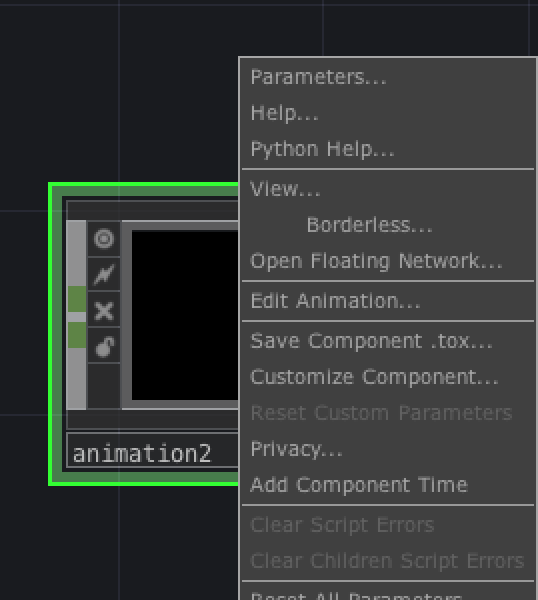
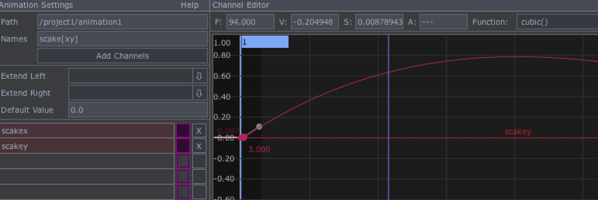

Drag: die ganze Kurve vershieben
Alt+Klick : neue Punkt hinzufügen

### 3D Display Option

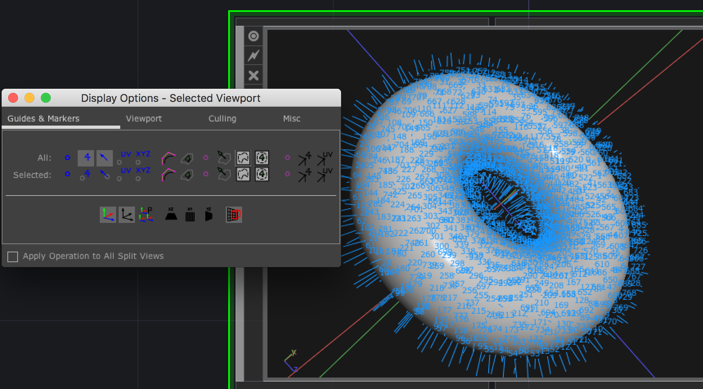

### Python

Python ... eine programmiersprache, die in TD eingebettet wird.

z.B. op('transform1')['chan1'] 

### Python Editor im TD

Textport and DATs

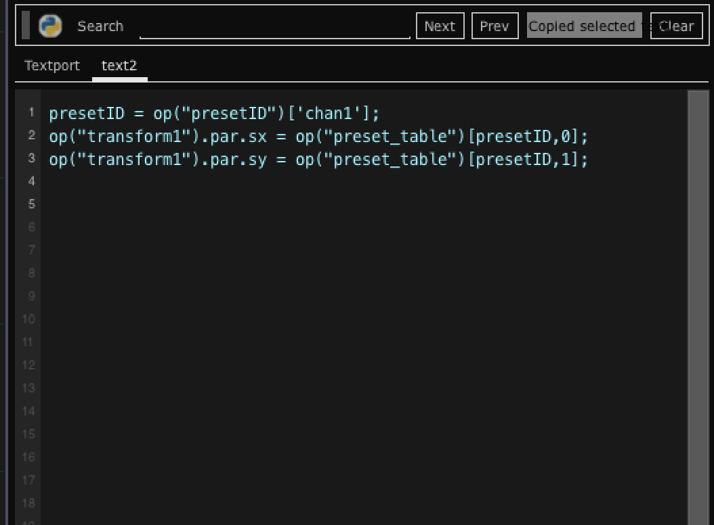
 
### Presetting mit DAT Text

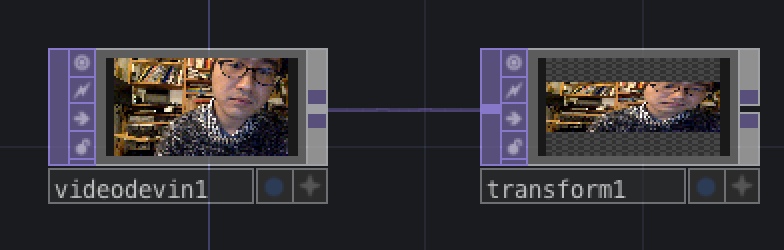

#### Daten aufrufen

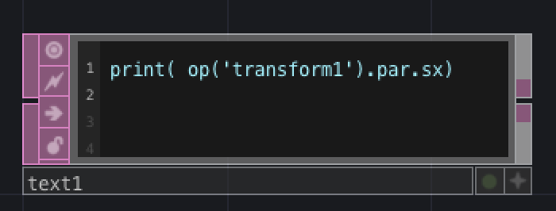
Cmd + R ... run script

#### Daten überschreiben

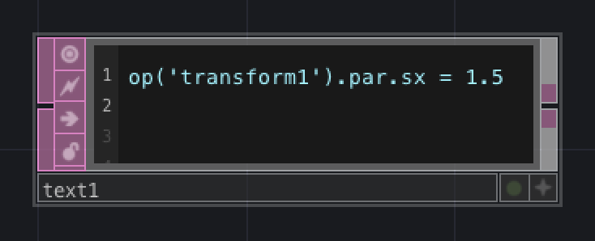

#### Preset

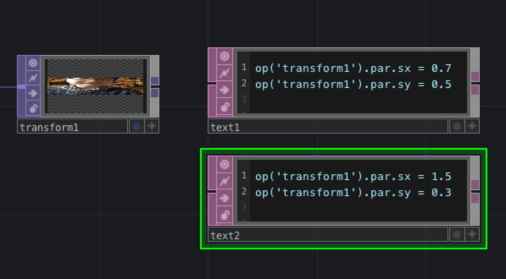

#### DAT/Table
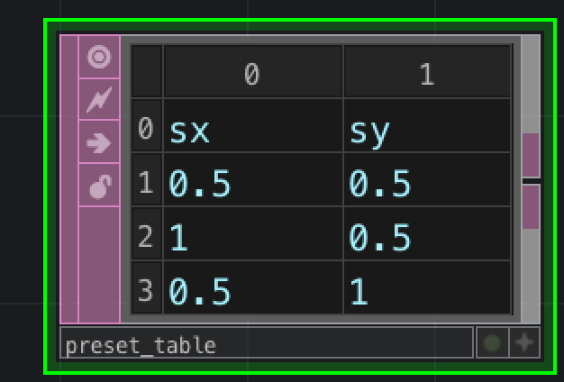

#### Table aufrufen

#### Presetting mit Table
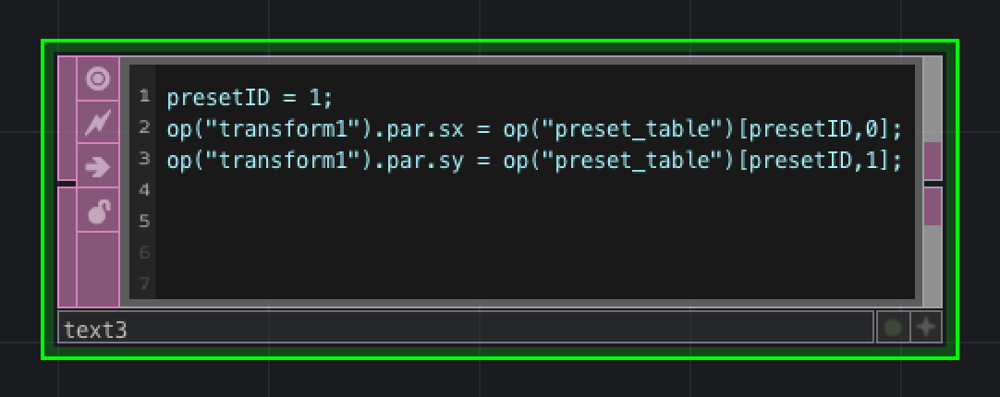

#### Kontroll mit CHOP
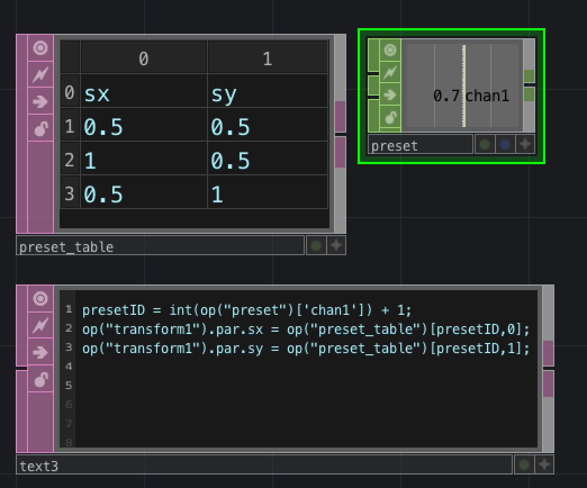

#### DAT/Chop to Execute

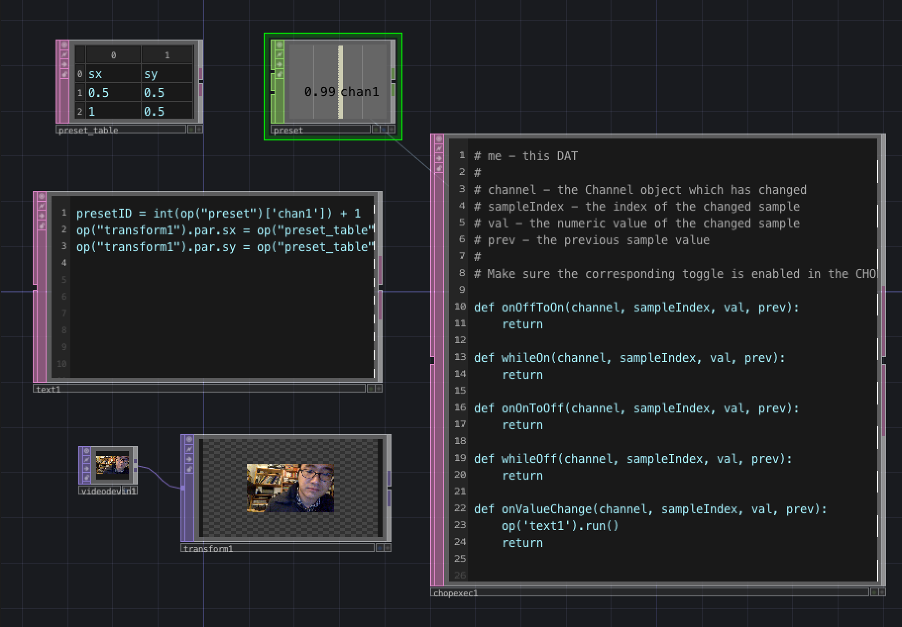
