# Klasse 8

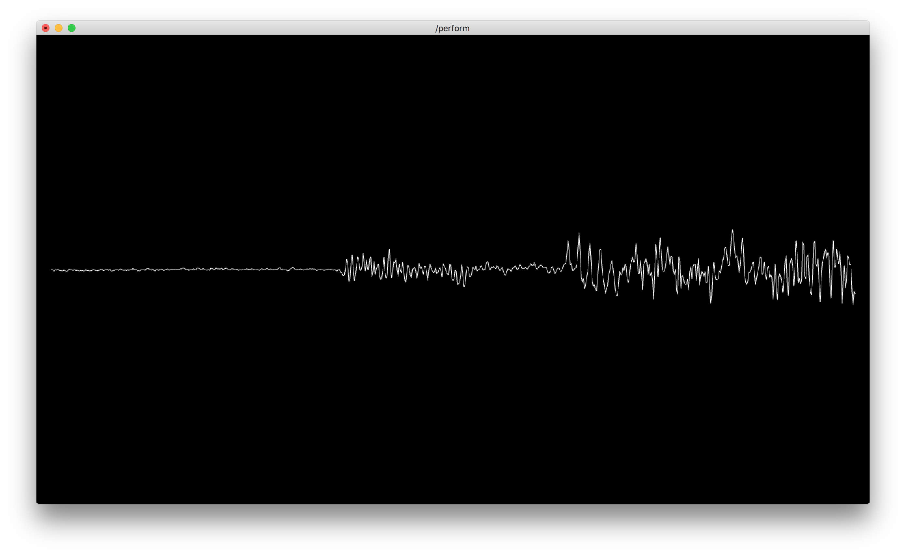

## Waveform

### SOP/Chop to

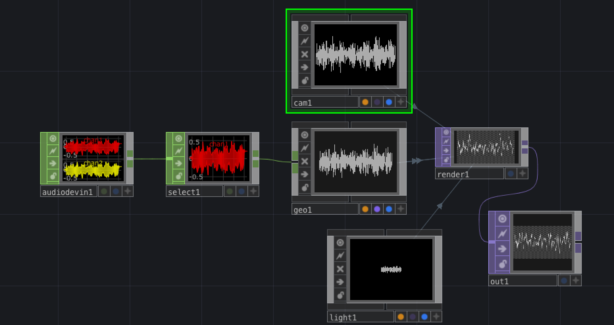
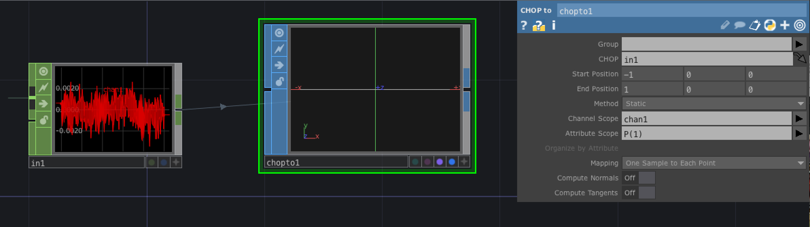

- chop to
	- channel scope: chan1
	- attribute scope: p(1)

## Lissajous

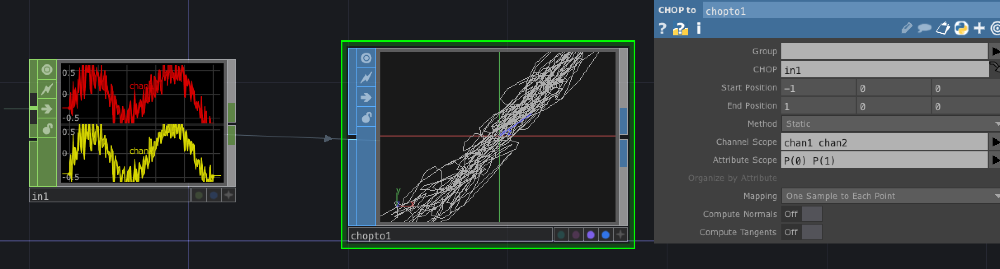
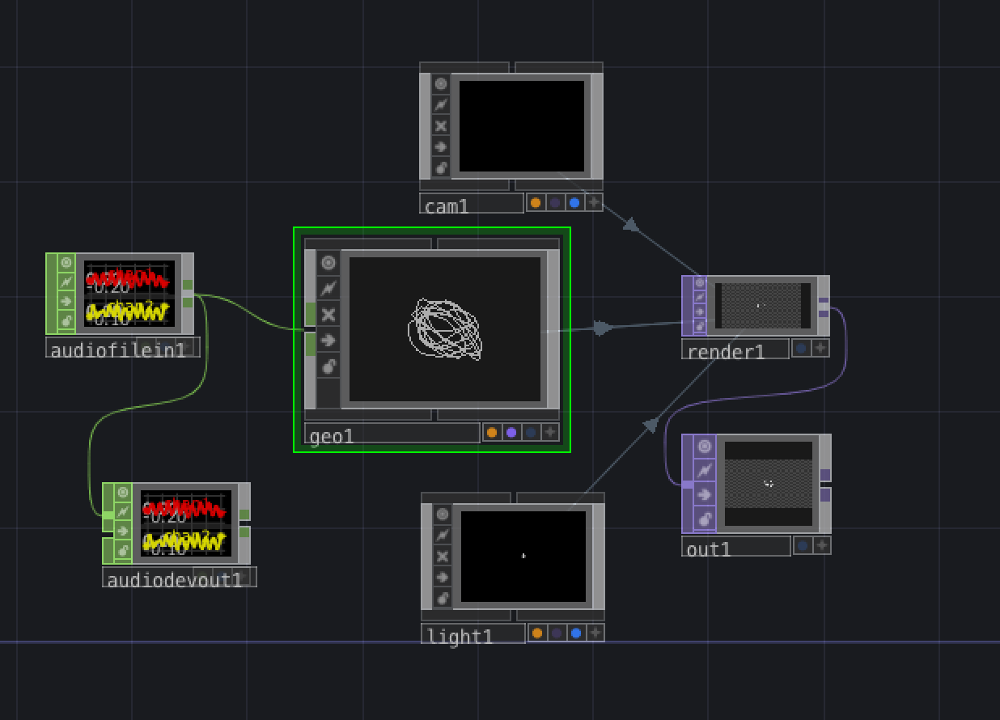

- chop to
	- channel scope: chan1 chan2
	- attribute scope: p(0) p(1) 
	
## Instancing

Steuert Eigenschaften von 3D-Modells  mit den Daten von CHOP

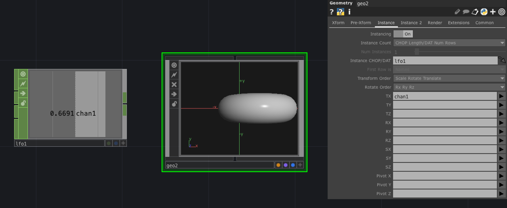

### Generator mit mehreren Kanälen

* t[xy] ... 2 Kanäle
* t[xyz] ... 3 Kanäle
* t[chikashi] ... 8 Kanäle

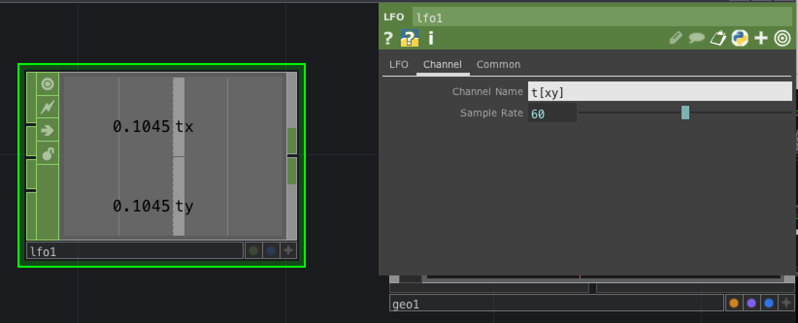

### 3D Mapping mit Chop

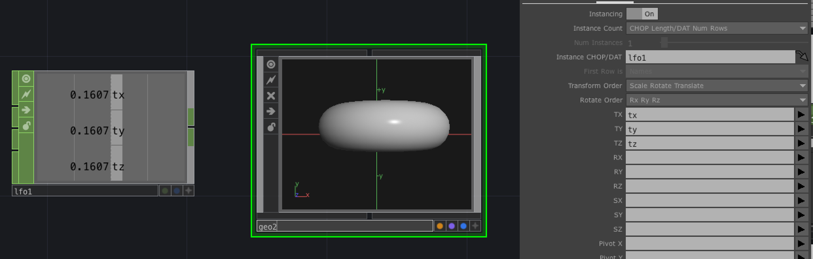

### Noise statt LFO

- noise erzeugt zu viele Abtaste, deshalb muss man mit "resample" die Anzahl von Samples reduzieren

### Mehrere Abtaste = Mahrere Objekte

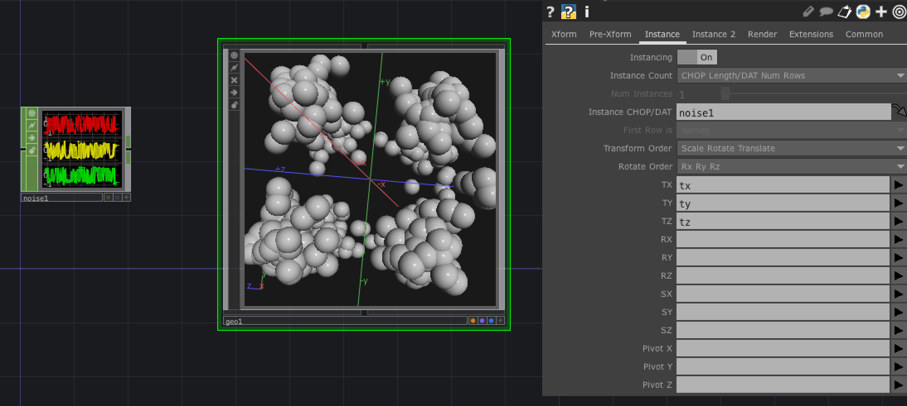

- Modell im COMP/Geo : Sphere SOP (sx 0.1, sy:0.1, sz:0.1)

### Noise steurt Noise

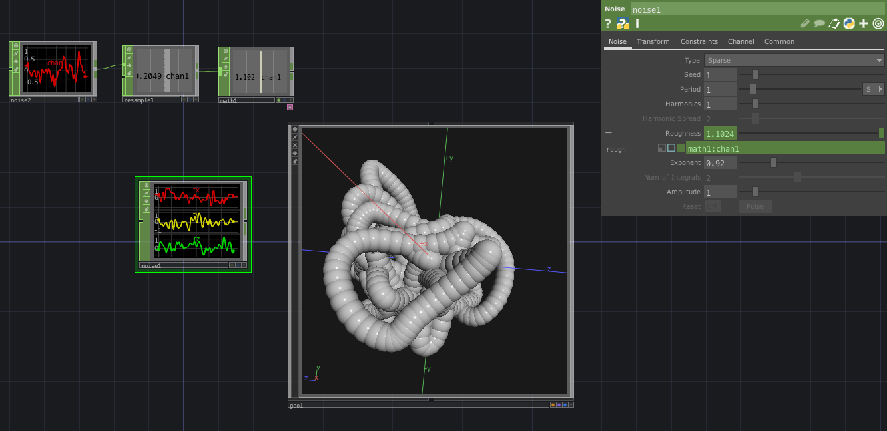

### Lissajous 3D

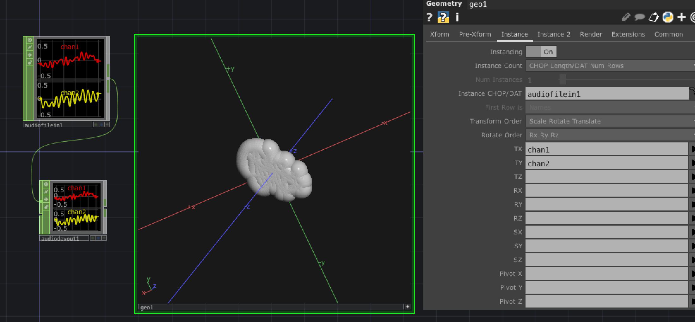

### Fake-Z

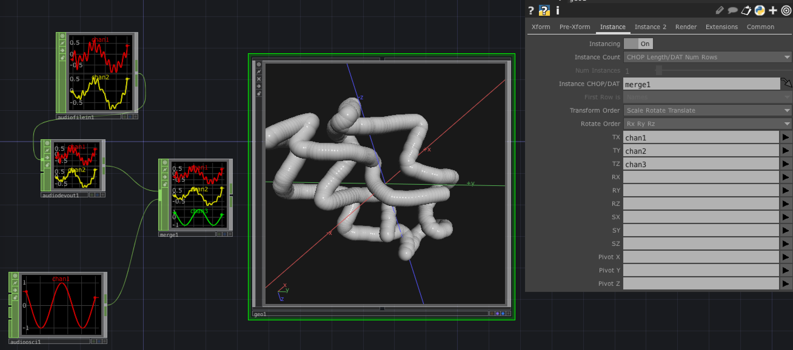

- Audio Oscillator steuert jetzt Z-Achse

